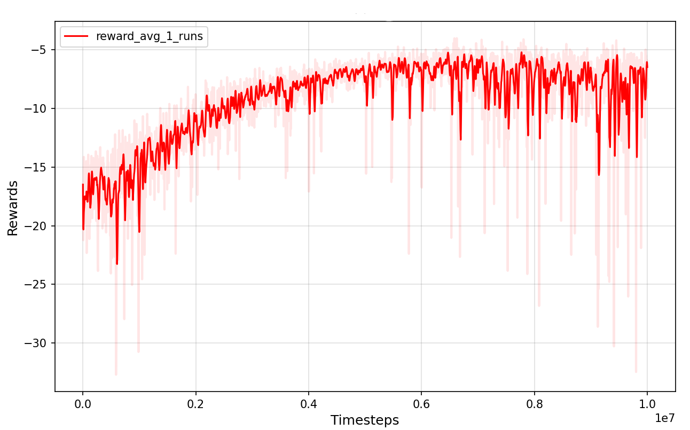

# stockTrading
This repository uses 한국 투자 증권 API to fetch stock information and applies a PPO algorithm implemented with PyTorch for reinforcement learning.
It supports image inputs such as chart images generated using CNNs and other time-series visual data.

# Image Generation

## Time-Series Images
- Supports six types of time-series image formats: `GASF`, `GADF`, `RP`, `MTF`, `STFT`, `CWT`  
- Specify the format using `visualization_format` in `StockConfig.yaml`  
- Set the number of data points to include using `extra_datas`  
- Define which data columns to convert into images using `visualization_columns`  

</img>

## Chart Graphs
- Set `visualization_format` to `graph` in `StockConfig.yaml`  
- Generates chart-based images using data such as closing price, high, low, Bollinger Bands, RSI, and trading volume  

</img>

# Program Structure

## Main Page
- Check CPU and GPU status  
- Start training or testing  
- View training progress logs  

</img>

## Hyperparameters Page
- Configure PPO hyperparameters  
  - Entropy coefficient  
  - Lambda (GAE)  
  - Learning rate  
  - Discount factor (Gamma)  
  - Minibatch size  
- Set stock data parameters  
  - Input data type (stock price, image data)  
  - Image data formats: `graph`, `GASF`, `GADF`, `RP`, `MTF`, `STFT`, `CWT`  

</img>

## Graph Page
- Visualize training logs as graphs  
- Visualize test results as graphs  

</img>

## Download Page
- Download stock data for training  
- Configure additional technical indicators:  
  - Moving Average Line  
  - RSI (Relative Strength Index)  
  - Bollinger Bands  
  - etc.

</img>

# Hyperparameter Settings

| Parameter                | Description                    | Value           |
| ------------------------ | ------------------------------ | --------------- |
| `max_training_timesteps` | Total number of training timesteps | `10,000,000`   |
| `max_ep_len`             | Maximum length of each episode  | `361`           |
| `K_epochs`               | Number of policy optimization iterations per update | `10`            |
| `gamma`                  | Discount factor (Discount Factor) | `0.99`          |
| `lamda`                  | Advantage discount factor (GAE λ) | `0.95`          |
| `eps_clip`               | PPO clipping range             | `0.2`           |
| `lr_actor`               | Learning rate for actor network | `0.0003`        |
| `lr_critic`              | Learning rate for critic network | `0.001`         |
| `entropy_coef`           | Entropy coefficient (Exploration control) | `0.01`         |
| `value_loss_coef`        | Value function loss coefficient | `0.5`           |
| `minibatchsize`          | Mini-batch size                | `128`           |
| `update_timestep`        | Policy update frequency (in timesteps) | `1440`       |
| `cnn_features_dim`       | CNN output feature size        | `256`           |
| `mlp_features_dim`       | MLP output feature size        | `32`            |

## Data and Visualization Parameters

| Parameter               | Description                                  | Value        |
| ----------------------- | -------------------------------------------- | ------------ |
| `extra_datas`           | Count of extra data to use per visualization | `60`         |
| `visualization_format`  | Visualization image format for extra data    | `GASF`       |

## Stock Columns
- `stck_clpr` (Closing Price)
- `stck_hgpr` (High Price)
- `stck_lwpr` (Low Price)
- `acml_vol` (Accumulated Volume)
- `prdy_vrss` (Previous Day Variation)
- `5` (5-day Moving Average)
- `20` (20-day Moving Average)
- `60` (60-day Moving Average)
- `rsi` (Relative Strength Index)
- `bb_upper` (Bollinger Band Upper)
- `bb_lower` (Bollinger Band Lower)

## Visualization Columns
- `stck_clpr` (Closing Price)
- `acml_vol` (Accumulated Volume)
- `5` (5-day Moving Average)
- `20` (20-day Moving Average)
- `60` (60-day Moving Average)
- `rsi` (Relative Strength Index)
- `bb_upper` (Bollinger Band Upper)
- `bb_lower` (Bollinger Band Lower)

# Reward Settings

The total reward \( R \) consists of two components: the expected return reward \( R_r \) and the overall asset change reward \( R_t \) for the next day.  

</img>

The reward range is between -1 and 1, and for this, an exponential function is used to structure the reward calculation.

</img>

</img>

If the asset drops by more than 5%, the training will be terminated early.

# Result
When looking at the reward graph, we can observe that the reward value gradually increases and converges.

</img>

However, the test results show that the buy/sell actions appear to be somewhat random.
It is necessary to adjust the reward function values to enable more systematic buy and sell.
</img>

# Install
```
pip install PySide6
pip install pycryptodome
pip install GPUtil
pip install py-cpuinfo
pip install pyts
pip install PyWavelets
```

If you have this error in ubuntu
```
/usr/lib/python3/dist-packages/requests/init.py:87: RequestsDependencyWarning: urllib3 (2.5.0) or chardet (4.0.0) doesn't match a supported version!
warnings.warn("urllib3 ({}) or chardet ({}) doesn't match a supported "
qt.qpa.plugin: From 6.5.0, xcb-cursor0 or libxcb-cursor0 is needed to load the Qt xcb platform plugin.
qt.qpa.plugin: Could not load the Qt platform plugin "xcb" in "" even though it was found.
This application failed to start because no Qt platform plugin could be initialized. Reinstalling the application may fix this problem.

Available platform plugins are: minimal, vkkhrdisplay, minimalegl, offscreen, wayland, eglfs, wayland-egl, vnc, xcb, linuxfb.

Aborted (core dumped)
```

```
sudo apt-get update
sudo apt-get install libxcb-cursor0
```

# Start Program
```
python3 mainWindow.py
```
If you want to proceed with training without a GUI program
```
python3 main.py
```